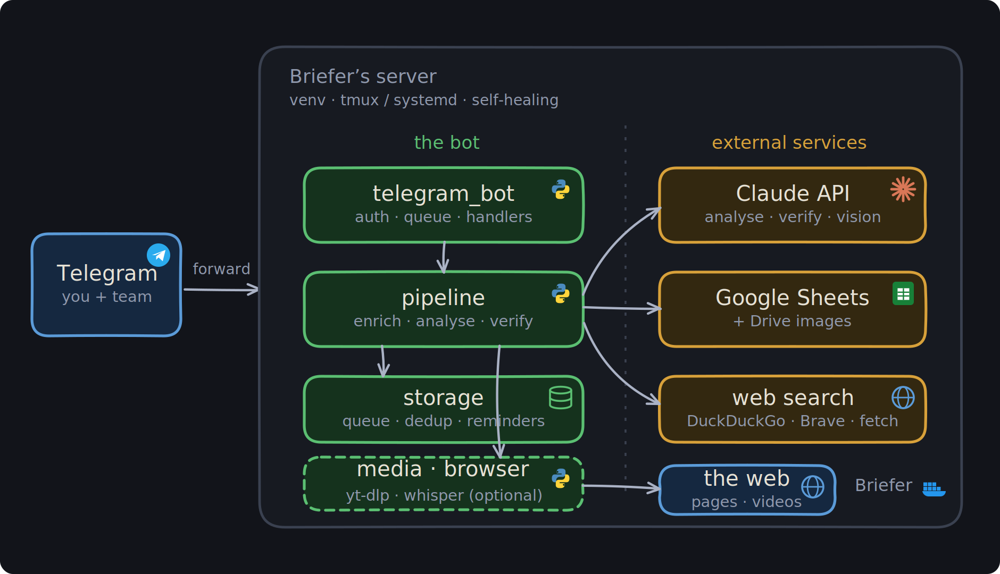
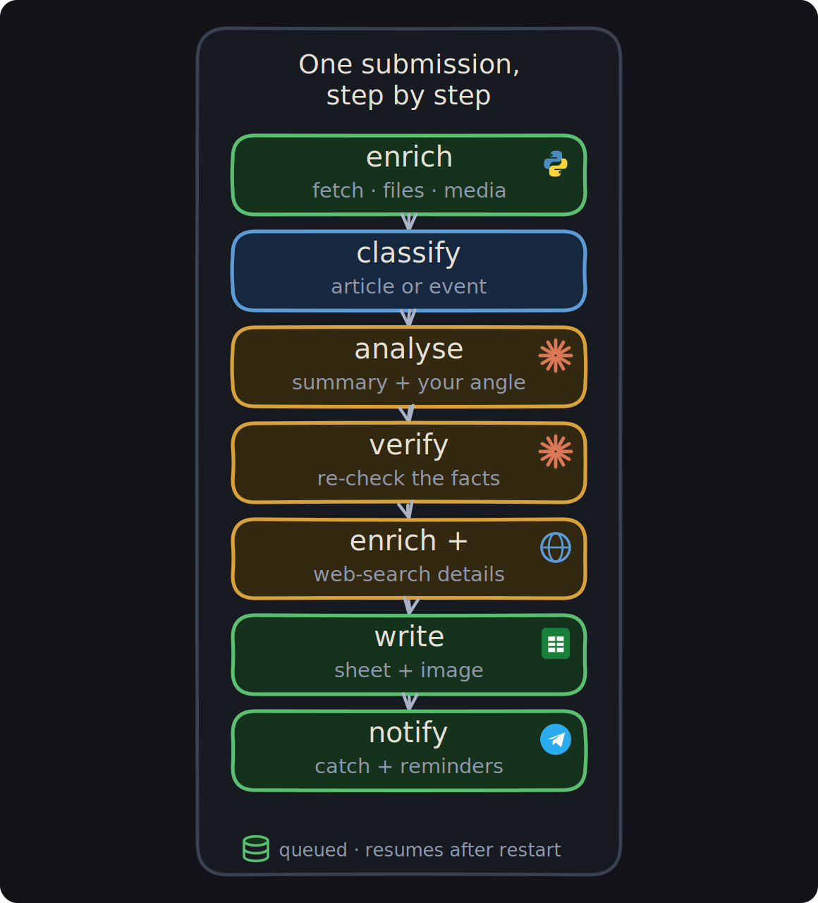

# Briefer 🎯

A secure, self-healing **Telegram intake analyst**. Forward it anything —
articles, posts, links, PDFs, images/screenshots, **videos & voice notes**,
**tweets/X posts** (incl. the replied-to and quoted/retweeted originals),
YouTube/Vimeo/TikTok links, GitHub repos, or event / Luma pages — and it will:

- **Summarise** the item and extract the **catch points**.
- Explain **where [Vivax](https://getvivax.com) could use it** (tailored to
  the company's focus: medical AI, medical education, clinical simulation and
  operating-room intelligence — configurable).
- For **events / calls**: pull out the **deadline, eligibility, required
  materials and how to apply** — including details found inside images, PDFs,
  or Luma pages.
- **Double-check its own output** with an independent verification pass to
  catch hallucinations (dates, numbers, links and criteria are re-validated
  against the source; unverified claims are flagged).
- Append the result to one of **two cumulative Google Sheets** —
  `Articles` and `Events` — that grow over time.
- **Poke you on Telegram** with the catch, and again **before every deadline**.

It ships with a **guide/help menu**, **password + allow-list auth**, a
one-command **server installer with a setup wizard**, **self-healing**
(systemd auto-restart + cron watchdog + boot revival), and a security model
designed so the bot can't be used to attack the server.

> 🎨 **Not medical? Not Vivax?** Briefer isn't tied to any company — point it
> at *your* focus with two env vars and it becomes your intake analyst. See
> **[Make it your own](docs/CUSTOMIZE.md)**.

---

## How it fits together 🧩

<p align="center">
  
</p>

One bot process on your server (in a venv, under tmux or systemd) does all the
work: it takes what you forward on Telegram, runs it through the pipeline, and
talks to three external services — **Claude** (analysis + verification),
**Google Sheets** (the two cumulative sheets) and **the web** (fetching &
search). State lives in a local SQLite database, so the queue and reminders
survive restarts.

<p align="center">
  
</p>

Every item is queued and processed one at a time, so nothing is dropped and
the API is never overwhelmed. *(Diagrams are generated by
`docs/diagrams/gen_diagrams.py`.)*

---

## Two "agents", one pipeline

| | Agent A — Articles/Posts | Agent B — Events |
|---|---|---|
| Trigger | auto-detected, or `/article` | auto-detected, or `/event` |
| Output | summary, catch points, Vivax relevance & use-cases, entities, tags, links | all of A **plus** deadline, event date, organizer, location, eligibility, required materials, application steps & URL, cost, verdict |
| Sheet | `Briefer — Articles` | `Briefer — Events` |
| Reminders | — | deadline pokes at 72h / 24h / 3h (configurable) |

Every item runs through: **enrich → classify → analyse → verify → write →
notify** (see `src/briefer/pipeline.py`).

---

## Quick start (server)

```bash
# 1. Copy this repo to your server
scp -r briefer/ user@server:/opt/briefer

# 2. Run the installer + wizard (installs deps, builds venv, writes .env,
#    installs a hardened auto-restarting service + cron watchdog)
cd /opt/briefer
sudo ./setup.sh
```

The wizard asks for your bot token, Anthropic key, allowed chat id(s),
login password (auto-generates a strong one if you leave it blank), the
Google service-account file, and (optionally) the two spreadsheet IDs. It
also asks for your **company name + focus** — that's what tailors every
"why does this matter to us?" analysis, so it works for any field, not just
medical AI. Change it any time in `.env`; full guide in
[`docs/CUSTOMIZE.md`](docs/CUSTOMIZE.md).

### First-run / finding your chat id
Leave `ALLOWED_CHAT_IDS` blank in the wizard to start in **bootstrap mode**.
Message the bot `/whoami`, copy the id it returns into `ALLOWED_CHAT_IDS`,
set `BRIEFER_BOOTSTRAP=0` in `.env`, then `./manage.sh restart`.

### Day-to-day control
```bash
./manage.sh start | stop | restart | refresh | reset | status | logs | update
```
- **refresh** – soft restart with current code/config
- **reset** – wipe runtime state (sessions, dedup, reminders); keeps `.env`
- **update** – `git pull` + reinstall deps + restart

---

## Google Sheets setup

See [`docs/SHEETS_SETUP.md`](docs/SHEETS_SETUP.md). In short:
1. Create a Google Cloud service account, enable the Sheets + Drive APIs,
   download its JSON key to the repo as `service_account.json`.
2. Create two spreadsheets (or let the bot auto-create them on first run).
3. **Share both sheets** with the service account's `client_email` as
   **Editor**. Put their IDs in `.env`.

---

## Telegram commands

`/start` `/help` `/menu` · `/article <text>` `/event <text>` ·
`/sheets` `/deadlines` `/calendar` `/stats` `/cookies` `/status` ·
`/login <pw>` `/logout` `/whoami` `/cancel`. Admins also get
`/allow <chat_id>`, `/deny <chat_id>`, `/allowlist`. The `/help` guide opens
automatically on `/start`.

`/calendar` shows a month grid of all your deadlines & event dates (plus a
button for a full interactive **HTML** calendar with Month/Week/Day/Year/List
views); `/stats` gives totals, done-%, overdue and time-to-check; `/cookies`
reports login freshness and warns before anything expires.

## Calendar (.ics) for events

For every event, Briefer also sends a **`.ics` file** as a Telegram document.
Open it on iPhone/Android and tap **Add to Calendar**. It embeds phone alarms
for **the day of** the event and **2h + 1h before**, and comes with a
**Google Calendar** button as a fallback. If there's no event date but there
is an application deadline, you get an all-day deadline entry instead.

## Adding people later

Put your own id(s) in `ALLOWED_CHAT_IDS`/`ADMIN_CHAT_IDS` at setup. To add
teammates afterwards, just send `/allow <their_chat_id>` from an admin chat —
no restart, no file editing. They still need the shared `/login` password.
Runtime additions persist in the local DB and appear in `/allowlist`.

## Queue, resume & checkpoints

- **Send many at once** — every message is added to a **durable SQLite queue**
  and a **single worker** processes them **one at a time**, so nothing is
  missed and the model/API is never overwhelmed. Each item's status message
  updates in place: *Queued → Analysing → result*.
- **Survives restarts** — the queue and attachments (stored as Telegram
  `file_id`s, re-downloaded on processing) persist. On startup, any job that
  was mid-flight is **requeued**, and pending jobs continue. The bot records
  the **last sheet row written** per sheet plus the processed count and last
  time, all shown in `/status`.

## The Done checkbox, deletions & check-time stats

Every row gets a **Done** checkbox plus **ID**, **Checked At** and
**Time→Check (h)** columns. A background sync (every ~60s) reconciles the
sheet with the bot's state:

- **Tick Done** → reminders for that item stop, and the **check time** +
  **time-to-check** are written to the row.
- **Un-tick** ("checked out") → treated as never checked; the clock keeps
  running from the original capture time.
- **Delete a row** → the bot notices it's gone, cancels its reminders and
  never reminds again (and counts it).
- A **Stats** tab in each spreadsheet shows totals, checked, removed, and the
  **average time-to-check**.

## Re-sending updates the row (cumulative)

Send the same article/event/file again and Briefer **merges any new info into
the existing row** (unioning catch-points, tags, criteria, etc.) instead of
just saying "already added". If nothing new is found, it says so and leaves
the row untouched.

## Files it reads

PDF, **Word (.docx)**, **PowerPoint (.pptx)**, **Excel (.xlsx)**, and plain
text/markdown/CSV/JSON — sent directly to the bot. Images/screenshots are read
by vision; audio/video are transcribed.

## Images in the sheet

Image attachments (photos, screenshots, tweet images) are uploaded to a
`Briefer Images` folder in your Drive and embedded in the sheet's **Image**
column via `=IMAGE(...)`. The row's untrusted data is still written `RAW`;
only the app-generated image formula is `USER_ENTERED`, so no forwarded
content can become a formula.

## Browser fallback (optional)

Some pages (LinkedIn, JS-only SPAs) return almost no text to a plain fetch.
Install a headless browser and Briefer will render those pages:
```bash
./manage.sh enable-browser      # installs Playwright + Chromium into the venv
```
It activates automatically only when the normal fetch comes back thin, and
is a no-op (graceful) if not installed. Toggle with `ENABLE_BROWSER_FALLBACK`.

### Logged-in content (LinkedIn, Instagram, private X)

These platforms show nothing to a logged-out visitor and have no public API —
the only way in is to fetch **as you**. Export a `cookies.txt` from your
logged-in browser and point `COOKIES_FILE` at it; the browser, `yt-dlp` and
`gallery-dl` all use it. Full guide: [`docs/COOKIES.md`](docs/COOKIES.md).
`cookies.txt` is a secret and is git-ignored. Without cookies, Briefer still
pulls the page's og:description snippet, and a **screenshot** works for any
platform.

## Video & tweet parsing

- **Tweets / X posts**: send a status link and Briefer extracts the post text,
  the tweet it's **replying to**, any **quoted** or **retweeted** original
  (with its text), and attached **photos** (read via vision) and **videos**
  (transcribed). Reads tweets **without any keys** via a no-auth fallback; for
  the official API set `TWITTER_BEARER_TOKEN`, or just
  `TWITTER_CONSUMER_KEY` + `TWITTER_CONSUMER_SECRET` (Briefer mints the bearer).
  Note: X's *Free* tier can't read tweets (paid Basic+ required) — the no-auth
  fallback covers reading either way.
- **Instagram / LinkedIn / Facebook**: no public read API exists for arbitrary
  posts. Briefer transcribes many **public IG reels / FB / LinkedIn videos**
  via yt-dlp, but for post *text* the reliable route on any platform is to send
  a **screenshot** (read via vision) or **paste the text** — that works
  everywhere and needs no credentials.
- **Videos & audio**: uploaded video/voice notes, and YouTube / Vimeo /
  **TikTok** / Instagram / Facebook / LinkedIn / X video links, are downloaded
  with **yt-dlp** and **transcribed** (captions when available, else local
  **Whisper**). Briefer also captures the post **caption/description** and
  grabs a few **keyframes** that are sent to the Anthropic **multimodal**
  model — so it *watches* the video (visuals) as well as *reads* it (audio +
  caption). Controlled by `ENABLE_TRANSCRIPTION`, `WHISPER_MODEL`,
  `VIDEO_KEYFRAMES`. **ffmpeg and Whisper are pip-installed inside the venv**
  (`imageio-ffmpeg` / `faster-whisper`) — no system packages. Set
  `ENABLE_TRANSCRIPTION=0` to skip it on tiny servers.
- **Image posts**: for photo posts yt-dlp can't handle (e.g. Instagram
  photos, Pinterest, galleries), a **gallery-dl** fallback downloads the
  images and feeds them to the vision model (`ENABLE_GALLERY_DL`). Public
  content only — private posts may need a login cookie.

## Networking / firewall

Briefer uses **outbound HTTPS on port 443 only** (Telegram, Anthropic,
Google) plus DNS, and opens **no inbound port** (it long-polls, not webhooks).
Fetched links are also restricted to ports 80/443. So a server that blocks
odd ports (e.g. IMAP 993) is fine — nothing here needs them. Egress via an
HTTP proxy is auto-detected and used.

---

## Security model

Briefer ingests fully-untrusted content, so it's built to contain it:

- **Access control** — only allow-listed Telegram chat ids that have
  `/login`-ed (shared password) are served; everyone else is silently
  ignored. `/login` messages are auto-deleted; only a PBKDF2 hash lives in
  memory.
- **No command execution** — user content never touches a shell. There is no
  `os.system`/`eval`/`exec` anywhere in the request path.
- **Prompt-injection guard** — the model is instructed that forwarded content
  is *data to analyse, not instructions to obey*, and injection attempts are
  flagged rather than followed.
- **SSRF protection** — every URL is resolved and rejected if it points at a
  loopback / private / link-local / cloud-metadata address, before and after
  redirects. Only `http(s)` schemes; size-capped downloads.
- **Rate limiting** per chat; input length/size caps.
- **Least privilege on the host** — runs as a dedicated non-login user under a
  hardened systemd unit (`NoNewPrivileges`, `ProtectSystem=strict`,
  `PrivateTmp`, seccomp `@system-service`, no capabilities, `MemoryDenyWriteExecute`).
- **Secrets** live in a `600` `.env`, are git-ignored, and are redacted from
  logs.

Full details in [`docs/SECURITY.md`](docs/SECURITY.md).

---

## Self-healing

- systemd `Restart=always` + `WantedBy=multi-user.target` → survives crashes
  **and reboots**.
- `/etc/cron.d/briefer` runs `deploy/healthcheck.sh` every 5 minutes and
  `@reboot` as a belt-and-braces watchdog that restarts the bot if it's down.
- Reminders are persisted in SQLite, so pending deadline pokes survive
  restarts.

---

## Layout

```
setup.sh              installer + interactive wizard (transfer this to server)
manage.sh             start/stop/restart/refresh/reset/status/logs/update…
deploy/               systemd unit, healthcheck watchdog
src/briefer/
  main.py             entrypoint & wiring
  config.py           env loading + validation
  version.py          reports the running git build (startup log + /status)
  telegram_bot.py     handlers, auth, menus, ingestion, reminders
  pipeline.py         enrich→classify→analyse→verify→write→notify
  analysis.py         the two agents + hallucination verifier
  enrich.py           SSRF-safe link/file/image/repo extraction
  media.py            tweets/X, video & audio (yt-dlp + Whisper), galleries
  sheets.py           two cumulative Google Sheets (+ Drive images, formatting)
  sheet_sync.py       reconciles the sheet (checkbox, deletes, Remind At) ~60s
  calendar_view.py    /calendar month grid + interactive HTML calendar
  reminders.py        natural-language "remind me …" parsing
  stats.py, tags.py   Stats tab + colored Status tags
  cookies.py          login-freshness checks + expiry warnings
  link_safety.py      guard-model + Safe-Browsing gate for nested links
  web_search.py       verified web-search enrichment
  security.py         auth hashing, rate limit, SSRF guard
  storage.py          sqlite state (queue, dedup, entries, reminders)
  llm.py              Anthropic wrapper (JSON + vision)
docs/
  CUSTOMIZE.md        make it yours (company focus, models, toggles)
  SHEETS_SETUP.md · SECURITY.md · COOKIES.md
  diagrams/           the generated architecture + pipeline SVGs
```

---

## Local development

```bash
python3 -m venv .venv && ./.venv/bin/pip install -r requirements.txt
cp .env.example .env   # fill it in
PYTHONPATH=src ./.venv/bin/python -m briefer

# run the tests (fast, offline — LLM/Sheets/network are faked)
PYTHONPATH=src ./.venv/bin/python -m pytest -q
```

---

## License

[MIT](LICENSE) © Ariorad Moniri. Free to use, fork and adapt — see
[**Make it your own**](docs/CUSTOMIZE.md) to point it at your own company and
content. The bundled hand-drawn diagram font (Patrick Hand) is under the SIL
Open Font License; see `docs/diagrams/fonts/`.

Contributions welcome — see [CONTRIBUTING.md](CONTRIBUTING.md) and the
[changelog](CHANGELOG.md).
